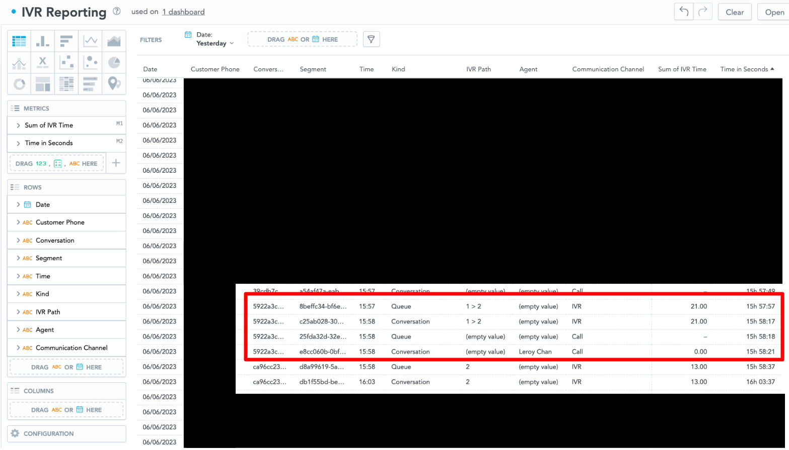
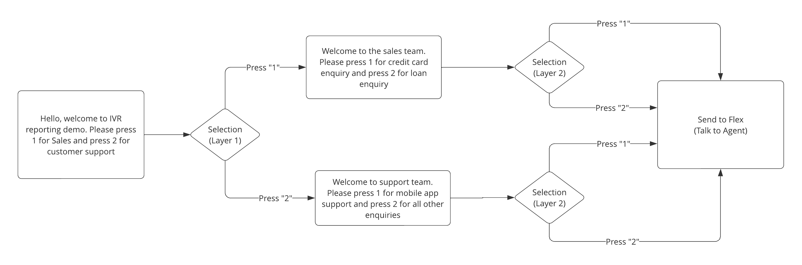

# Twilio Flex - Reporting of IVR Paths in Flex Insights

This repository provides a solution for reporting IVR paths taken by end users in Flex Insights. The solution is based off the [Twilio Blog Post - Link IVR Time/Path with Inbound Calls Using Flex Insights](https://www.twilio.com/blog/ivr-with-flex-insights) with the following features enhancement:

1. Supports multiple layers of IVR selections (demo within the Terraform template is 2 layers)
2. Auto append `Digits` selection into `IVR_Path` in the format `DIGIT_SELECTED > DIGIT_SELECTED > ...` for Flex Insights Reporting

The solution utilizes Terraform to create independent Twilio resources required to demonstrate the IVR reporting functionality.



---

## Demo IVR Flow

Below is the IVR Flow (in Studio) that will be created by the Terraform template:



---

## Pre-requisites

1. Twilio Flex Account ([Guide](https://support.twilio.com/hc/en-us/articles/360020442333-Setup-a-Twilio-Flex-Account))
2. Flex Insights Enabled on Flex Account ([Guide](https://support.twilio.com/hc/en-us/articles/360010705874-Getting-Started-with-Flex-Insights))
3. Node.js v16.x.x only ([Guide](https://docs.npmjs.com/downloading-and-installing-node-js-and-npm))
4. Terraform v1.4.6 and above ([Guide](https://developer.hashicorp.com/terraform/tutorials/aws-get-started/install-cli))

## Terraform

Within this terraform template, it will create all the required resources to demostrate the solution. You can safely perform `terraform destroy` without having to worry about deleting any existing Twilio resources that you already have.

All resources created will be prefixed with `[IVR Reporting]` for easy identification.

The following resources are created as part of the Terraform template:

| Friendly Name                         | Resource Type | Description                                                                                                      |
| ------------------------------------- | ------------- | ---------------------------------------------------------------------------------------------------------------- |
| [IVR Reporting] Everyone Queue        | Task Queue    | Acts as a task queue for routing to every agent if the end-user choose to talk to an agent                       |
| [IVR Reporting] Placeholder Queue     | Task Queue    | Placeholder task queue to place task created to track IVR path. No workers should be matched to this task queue. |
| [IVR Reporting] Workflow - Everyone   | Workflow      | TaskRouter workflow to allow Studio to route to every agent                                                      |
| [IVR Reporting] Workflow              | Workflow      | TaskRouter workflow for placeholder queue                                                                        |
| [IVR Reporting] Studio Flow           | Studio Flow   | Studio Flow for integration into any active Twilio number to demonstrate the solution                            |
| [IVR Reporting] IVR Reporting Handler | Functions     | Processing logic for creating/updating placeholder task with IVR path details                                    |

---

## Step 1: Deploy Required Resources Using Terraform

Ensure that you have the following values before proceeding:

1. Twilio Flex Account SID
2. Twilio Flex Account Auth Token

On your terminal, perform the following:

```
// Clone Project
git clone https://github.com/leroychan/twilio-flex-ivr-reporting

// Change to working directory
cd twilio-flex-routing-redirect-call

// Change to terraform working directory
cd terraform/environments/dev

// Terraform - Init
terraform init

// Terraform - Plan
terraform plan

// Terraform - Deploy
terraform deploy

```

## Step 2: Configure Active Twilio Number to Studio Flow Created

Navigate over to `Console > Phone Numbers > Manage > Active Numbers`:

1. Choose a phone number that you would like to be used for the solution demostration.
2. Set the `Voice Configuration` for `A call comes in` to be `Studio Flow`
3. For the `Flow`, select `[IVR Reporting] Studio Flow`

## Step 3: Done !

You are now ready to start testing the reporting of IVR in Flex Insights

Start by calling the E.164 Number configured for Twilio Flex (from Step 2) and press the necessary options (`1` or `2`) twice before getting connected to an agent

To create the report in Flex Insights, you can leverage on the attributes `IVR Path` to view the end-user IVR selection path.

_Note: The default data refresh rate for Flex Insights is 1 hour. You might need to wait 1 hour before seeing it on your Flex Insights_
